I’m a software engineer for [Neara](https://neara.com). I specialise in computationally heavy, or mathematically focused software.
I'm currently working on finite-element calculation software.

Previously I worked at [DUG](https://dug.com) where my work revolves around adding support for integrating custom code into the [DUG Insight](https://dug.com/dug-insight/) scientific platform. At DUG I've previuosly worked on [DUG Wave](https://dug.com/geoscience-services/full-waveform-inversion-fwi/) and several other tools.

I founded Run With Robots, and lead development of our Roar engine for online social games.

I was also head of R&D for Rising Sun Research, which developed acadamy award winning software for the visual effects industry.

These days when I'm developing software for fun I use rust. Some of my recent rust projects include:

* [gdocbak](https://github.com/mikeando/gdocbak): A small tool running on a home Rapberry-Pi 2 that backs up a variety of google documents weekly. (Complete)
* [gnarled](https://github.com/mikeando/gnarled): An experimental library for programatic art creating SVGs (with a view to pen plotting). (WIP)
* **twirl**: A markdown library that aims for GFM / commonmark compliance, and can properly roundtrip markdown->Ast->markdown. (Passing 1450 / 1600 test)
* [markovian](https://github.com/mikeando/markovian): A name/text generation tool using Markov chains and grammars.
* **AuthorsNotebook**: An application for plotting and writing novels in markdown, with export of annotated drafts to Latex (and eventually .docx) (WIP)
* An application for tracking progress and setting weekly and daily goals for novel writing.(WIP)

And probably a bunch of other things.
